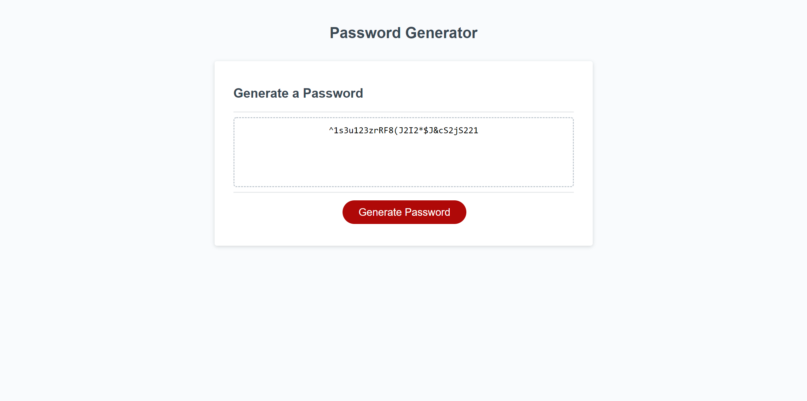

# Password Generator 
This is a password generator I made for a challenge at Columbia Coding Bottcamp

# Purpose
It prompts the user for a password length and generates one based on selections made by the use

# Built With
Javascript, HTML, CSS

# Screenshots

# Link To Deployed Website
https://mkhlink.github.io/password_generator/

# Contributors
Mohammad Komol Hasan
